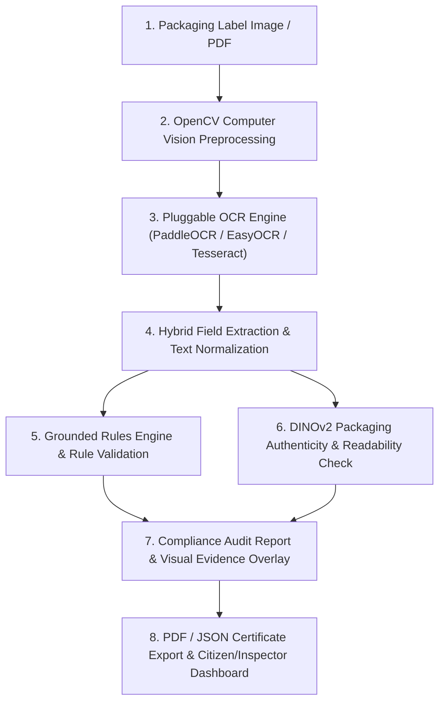

# 🏛️ Architecture Overview: LegalMetrix Compliance & Computer Vision System

> **Problem Statement 26034**: *Software System to check compliance of Packaged Commodities under Legal Metrology (Packaged Commodities) Rules, 2011.*

---

## 🎯 Executive Summary for the Jury

**LegalMetrix** is an enterprise-grade AI software system designed for the **Department of Consumer Affairs (DoCA), Ministry of Consumer Affairs, Food and Public Distribution, Government of India**. 

The system automates the inspection and verification of packaged commodity labels against the **Legal Metrology (Packaged Commodities) Rules, 2011** (including all gazette amendments up to 2026). It ingests packaging images or PDF documents, automatically extracts mandatory declarations (such as MRP, Net Quantity, Date of Manufacture, Consumer Care details, Country of Origin, and Manufacturer name), calculates physical legibility metrics, evaluates brand authenticity using AI vision transformers, and highlights non-compliance issues with exact legal citations.

### 🛍️ Dual Inspection Capabilities
- **Primary Mode (Physical Packaged Commodity)**: Camera capture or photo upload of physical boxes, wrappers, or label panels. Evaluates full statutory text declarations, physical font height in mm, and principal display panel quadrant placement.
- **Secondary Mode (E-Commerce Product Listing)**: Image upload or screenshot of online marketplace listings (Amazon, Flipkart, Blinkit, Zepto, brand storefronts). Evaluates all mandatory statutory text declarations (`input_type=ecommerce_listing`) while setting physical package dimension checks to *Not Applicable / Informational*.
- **Extensible Architecture**: The engine architecture is designed to support deeper listing scraping, multi-image product carousel analysis, and automated e-commerce web crawler integration in future releases.

---

## 📂 High-Level Folder Structure & Responsibilities

```
SIH_OCR-main/
├── backend/                        # FastAPI Python Server & AI Core
│   ├── app/
│   │   ├── main.py                 # REST API endpoints & lifecycle handlers
│   │   ├── ocr/                    # OpenCV preprocessing & OCR engines (PaddleOCR, Tesseract, EasyOCR)
│   │   ├── extraction/             # Named Entity Recognition & regex field extractors
│   │   ├── vision/                 # Readability analysis, bounding box utils & DINOv2 authenticity engine
│   │   ├── rules/                  # Grounded Rules Engine & official DoCA legal database
│   │   │   ├── rules.json          # Declarative rule definitions linked to official gazette PDFs
│   │   │   └── official_source/    # Extracted legal text corpus & search index
│   │   ├── validators/             # Modular legal rule validators (MRP, Qty, Dates, Address, etc.)
│   │   ├── services/               # Orchestration service combining OCR, vision, rules & db
│   │   ├── db/                     # PostgreSQL / SQLite database models & repositories
│   │   └── chatbot/                # Conversational RAG assistant grounded on PCR 2011 laws
│   └── tests/                      # Automated test suite (Pytest - 31/31 tests passing)
│
├── frontend/                       # React 19 + TypeScript + Vite Dashboard
│   ├── src/
│   │   ├── components/             # Packaging scan upload, live bounding box overlay, audit report UI
│   │   ├── services/               # Axios API client integrations
│   │   └── App.tsx                 # Dynamic tab routing and state management
│   └── public/                     # Static media & branding assets
│
├── docker-compose.yml              # Production orchestration (Backend, Frontend, Postgres, Redis)
├── DEPLOYMENT.md                   # Enterprise & Air-Gapped Deployment Manual
└── ARCHITECTURE.md                 # System Architecture & Jury Reference Guide
```

---

## 🔄 Step-by-Step Data Flow Pipeline (Plain Language)



### 1. Image Acquisition & Ingestion
- **What Happens**: The user (Legal Metrology Inspector, E-commerce Auditor, or Citizen) uploads a photograph or PDF of a product label via the React web frontend or API endpoint.
- **Key Modules**: [frontend/src/components/ScanUpload.tsx](file:///c:/Users/ELCOT/Downloads/SIH_OCR-main/SIH_OCR-main/frontend/src/components/ScanUpload.tsx), [backend/app/main.py](file:///c:/Users/ELCOT/Downloads/SIH_OCR-main/SIH_OCR-main/backend/app/main.py).

### 2. Image Preprocessing & Quality Enhancement
- **What Happens**: Before reading text, OpenCV enhances the image by removing shadows, adjusting contrast (CLAHE), correcting rotation angle, and converting to high-contrast grayscale.
- **Key Modules**: [backend/app/ocr/preprocessing.py](file:///c:/Users/ELCOT/Downloads/SIH_OCR-main/SIH_OCR-main/backend/app/ocr/preprocessing.py).

### 3. Text & Bounding Box Recognition (OCR)
- **What Happens**: Pluggable OCR engines read all text snippets on the packaging and return both the text characters and their exact pixel coordinates (`x_min`, `y_min`, `width`, `height`).
- **Key Modules**: [backend/app/ocr/ocr_engine.py](file:///c:/Users/ELCOT/Downloads/SIH_OCR-main/SIH_OCR-main/backend/app/ocr/ocr_engine.py).

### 4. Smart Field Extraction & Key-Value Parsing
- **What Happens**: Text blocks are categorized into mandatory legal fields (MRP, Net Qty, Dates, Address, Expiry, Country of Origin) using hybrid contextual patterns and proximity analysis.
- **Key Modules**: [backend/app/extraction/declaration_extractor.py](file:///c:/Users/ELCOT/Downloads/SIH_OCR-main/SIH_OCR-main/backend/app/extraction/declaration_extractor.py).

### 5. Legal Rule Verification (Rules Engine)
- **What Happens**: Extracted fields are tested against official legal rules in `rules.json` (e.g., verifying if MRP includes "inclusive of all taxes", if Net Quantity uses standard SI units, if Month/Year of manufacture is present).
- **Key Modules**: [backend/app/rules/rule_engine.py](file:///c:/Users/ELCOT/Downloads/SIH_OCR-main/SIH_OCR-main/backend/app/rules/rule_engine.py), [backend/app/validators/](file:///c:/Users/ELCOT/Downloads/SIH_OCR-main/SIH_OCR-main/backend/app/validators/).

### 6. Readability & Anti-Counterfeiting Assessment
- **What Happens**: 
  - **Readability**: Calculates physical font height (mm), background contrast ratio, and spatial position on the package to ensure legibility as per Rule 9.
  - **Authenticity**: Uses Meta's **DINOv2 (Vision Transformer)** model to extract feature embeddings of the packaging artwork/logo and compare against registered authentic brand reference patterns.
- **Key Modules**: [backend/app/vision/readability.py](file:///c:/Users/ELCOT/Downloads/SIH_OCR-main/SIH_OCR-main/backend/app/vision/readability.py), [backend/app/vision/authenticity.py](file:///c:/Users/ELCOT/Downloads/SIH_OCR-main/SIH_OCR-main/backend/app/vision/authenticity.py).

### 7. Interactive Audit & PDF Certificate Export
- **What Happens**: The user receives a comprehensive compliance score (0-100%), visual bounding box overlays highlighting compliant vs non-compliant declarations in green/red, exact DoCA gazette citations, and downloadable legal audit certificates.
- **Key Modules**: [frontend/src/components/LiveResultsView.tsx](file:///c:/Users/ELCOT/Downloads/SIH_OCR-main/SIH_OCR-main/frontend/src/components/LiveResultsView.tsx), [backend/app/services/compliance_service.py](file:///c:/Users/ELCOT/Downloads/SIH_OCR-main/SIH_OCR-main/backend/app/services/compliance_service.py).

---

## 🏛️ Government Compliance & Legal Alignment Highlights

1. **Grounded Legal Source of Truth**: Evaluates compliance directly against official Department of Consumer Affairs gazette notifications and SOPs.
2. **Zero External API Dependency**: Designed to run 100% locally or inside secure State Data Center (SDC) / National Informatics Centre (NIC) air-gapped environments.
3. **Auditability & Explainability**: Every compliance score or failure notice provides exact clause citations (e.g., *Rule 6(1)(e) read with Rule 2(m)*) and bounding box evidence.
