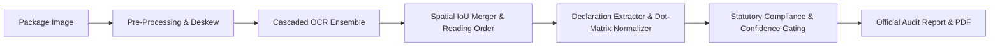

# PRAMAN — Automated Legal Metrology & Food Safety Label Compliance Engine
**Project Repository:** `SripathiRajan/SIH_26034`  
**Regulatory Framework:** Legal Metrology (Packaged Commodities) Rules, 2011 (as amended) & FSSAI (Labelling & Display) Regulations, 2020  
**Document Version:** 4.0.0 (Production-Ready) · Updated September 2026

---

## 1. Executive Summary

**PRAMAN** is an end-to-end, AI-powered regulatory audit platform designed for Legal Metrology enforcement officers and consumer protection inspectors. The system automatically inspects FMCG packaged commodities from photos or camera scans, extracts mandatory statutory declarations, verifies compliance against exact legal clauses, gates low-confidence extractions, and generates official, tamper-evident audit inspection reports.

---

## 2. Core Architecture & Technology Stack

### 2.1 Backend Architecture (FastAPI + Cascaded AI Pipeline)
* **Framework:** FastAPI (Python 3.11/3.14) with Uvicorn ASGI server and SlowAPI rate limiting.
* **Security & Auth:** Native `bcrypt` key derivation with auto-generated 12-round salt, constant-time token verification, and strict role enforcement (`inspector` allowlist).
* **Database & ORM:** SQLAlchemy with SQLite/PostgreSQL, managing scan history, user authentication, and product master records (GTIN/Barcode catalog) using SQL aggregation (`func.count`, `group_by`).
* **Deep Neural OCR Ensemble:**
  * **Primary (Tier 1 Fast Path):** PaddleOCR with MKL-DNN acceleration. When confidence $\ge 0.60$ and all mandatory fields are detected, Tier 2 is bypassed.
  * **Secondary (Tier 2 Multilingual Ensemble):** EasyOCR PyTorch engine + SuryaOCR line-level recognition running in parallel.
  * **Image Enhancement:** Automatic CLAHE contrast enhancement retry for faint or stamped declarations.
  * **Fallback (Tier 3 VLM):** Microsoft Florence-2 Vision-Language Model for occluded or curved package declarations.
* **Spatial & Layout Reasoning:** `ReadingOrderResolver` + geometric Polygon IoU ($\ge 0.45$) spatial fusion to reassemble dot-matrix, horizontal, and vertical text into logical semantic lines.
* **Extraction Normalization:** Dot-matrix date disambiguation (`1UN/2026` $\rightarrow$ `JUN/2026`, `0CT` $\rightarrow$ `OCT`), MRP currency cleaning (`?` $\rightarrow$ `₹`), and strict 14-digit FSSAI license validation.

### 2.2 Frontend Architecture (Cross-Platform React Native + Expo)
* **Framework:** Expo 51 (React Native 0.74) supporting Web, Android, and iOS.
* **Design System:** Glassmorphic theme (`tokens.ts`, `GlassCard`, `DottedBackground`, SVG iconography).
* **Authentication State:** Persistent `AuthContext` utilizing universal local storage to retain officer sessions across browser refreshes.
* **Offline Synchronization:** `offlineQueue` storing base64 frames during connectivity dropouts, syncing automatically via `POST /api/scans/sync` when reconnected.
* **Inspector Notes & PDF Export:** Integrated note editing with `PATCH /api/scans/{id}/notes` and direct download from `GET /api/scans/{id}/pdf`.
* **Honest Demo Mode:** Persistent visual banner (`<DemoBanner />`) displayed only when `EXPO_PUBLIC_DEMO=1`. Silent mock fallbacks are completely eliminated in production.

---

## 3. Mandatory Statutory Declarations Audited

The compliance engine audits packages against the **Legal Metrology (Packaged Commodities) Rules, 2011** and **FSSAI Regulations**:

| Statutory Rule | Declaration Requirement | Verification & Validation Method | Enforcement Penalty |
| :--- | :--- | :--- | :--- |
| **Rule 6(1)(a)** | Name and complete address of manufacturer, packer, or importer. | Multi-keyword pattern matching (`MANUFACTURED BY`, `MARKETED BY`, `PACKED BY`) + spatial reading order. | Fine up to ₹25,000 (Sec 36 LMA) |
| **Rule 6(1)(c)** | Net quantity in standard metric units (`g`, `kg`, `ml`, `l`, `m`, `cm`, `count`, `units`). | Standard metric unit whitelist validation; imperial-only units flagged as non-compliant. | Fine up to ₹25,000 |
| **Rule 6(1)(d)** | Month and year of manufacture, packing, or import. | Dot-matrix normalizer (`1UN` $\rightarrow$ `JUN`, `0CT` $\rightarrow$ `OCT`, `0EC` $\rightarrow$ `DEC`), 2-to-4 digit year expansion, and flap pointer recognition (`"See bottom of pack..."`). | Fine up to ₹25,000 |
| **Rule 6(1)(da)** | Use By / Best Before / Expiry date. | Statutory date format disambiguation and shelf-life period parser. | Fine up to ₹25,000 |
| **Rule 6(1)(e)** | Maximum Retail Price (MRP) inclusive of all taxes. | Currency symbol tolerance (`₹`, `Rs.`, `INR`, `?`), tax inclusion statement verification (`"(inclusive of all taxes)"`). | Fine up to ₹50,000 / 1 yr imprisonment |
| **Rule 6(2)** | Consumer Care Details (Phone helpline and email). | Multi-tier regex matching toll-free helplines (`1800-...`), STD numbers, and support email addresses. | Fine up to ₹25,000 |
| **Rule 6(1)(aa)** | Country of Origin for imported and domestic goods. | Explicit origin declarations (`Made in India`, `Product of...`) or verified domestic manufacturer address. | Fine up to ₹25,000 |
| **FSSAI §2.1.1** | Food Safety License Number. | Strict 14-digit structural numeric verification; invalid digit lengths rejected. | Suspension / cancellation of license |

---

## 4. Verification & Quality Assurance

* **Backend Test Suite:** 34 unit & integration tests passing 100% (`tests/test_api_endpoints.py`, `tests/test_dates.py`, `tests/test_ocr_ensemble.py`, `tests/test_pipeline_extraction_rules.py`, `tests/test_rules.py`).
* **Accuracy Evaluation Harness:** `scripts/eval_accuracy.py` benchmarking Precision, Recall, and F1 scores against annotated ground truth (`eval/annotations/sample_packaging.json`).
* **Frontend Type Safety:** TypeScript compiler (`npx tsc --noEmit`) passes with 0 errors.
* **Containerization:** Production Docker image and `docker-compose.yml` for unified deployment.
